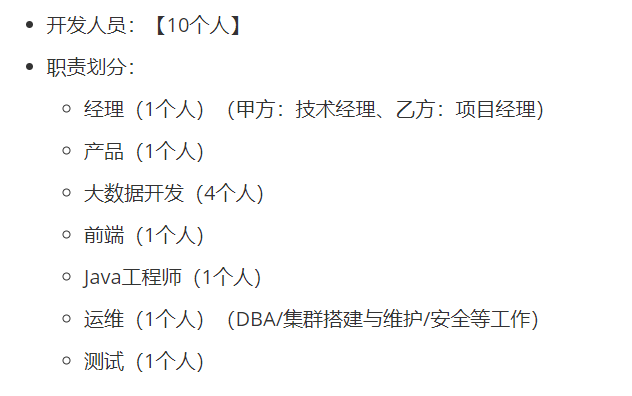

#### 你们数据数仓几个库

分了几层就有多少个库 

公司人员分布图：

#### Hive行转列和列转行

列转行 配合UDTF来使用,把某一行数据拆分成多行数据

​             炸裂函数lateral view

行转列  collect_list 不去重

​              collect_set 去重

​              concat 将字符串变成一个字符串

​              concat_wc 可以指定分隔符

------------------------------------------
#### Hive 4个 By的区别

1,order by : 全局排序 只有一个reduce

2,sort by  :局部排序，对每一个reduce内部排序

3,distribute by ：需要设置分区数量，否者不会启动

​                           类似于map中的partition,进行分区，结合sort使用，使用时多配置reduce进行处理

4,cluster by  ：当dister by和sort by 字段相同时，可以使用这种方式，具有distribute by 和sort by 的功能，但是只能升序不能降序
-------------------------------

## Flink

#### 你Flink都用哪些算子

Map,filter,keyby,flatmap,windo(常用)reduce,spilt

#### Flink和SparkStreaming的区别 storm

1-Flink采用流处理,处理低延迟和高吞吐量的流处理任务
2-SparkStreaming采用微批处理,可能会有一定的延迟,处理生态系统紧密集成的项目

### Yarn

yarn的调度器

容量，公平，先进先出
